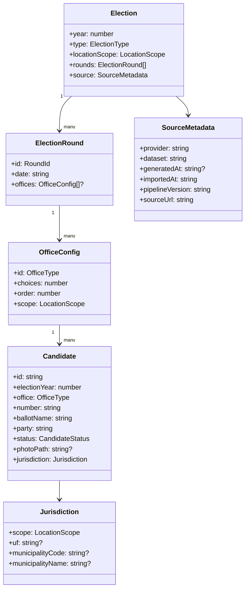

# 04 — Modelo de dados

## 1. Objetivo

O projeto não precisa de um modelo relacional tradicional porque não existe banco de dados de usuários ou colinhas. O modelo importante é o **contrato de dados estáticos consumido pela SPA**.

O modelo interno deve ser pequeno, estável e independente da estrutura bruta dos arquivos do TSE.

## 2. Princípio de normalização

```text
Modelo externo do TSE
        ↓
   parser versionado
        ↓
 validação + mapeamento
        ↓
 Modelo interno Colinha
        ↓
 artefatos estáticos
```

A SPA não deve depender diretamente de nomes de colunas do CSV do TSE.

## 3. Modelo conceitual



## 4. Tipos principais

### 4.1 Election

Representa uma eleição suportada.

Campos mínimos sugeridos:

```ts
interface Election {
  year: number;
  type: "GENERAL" | "MUNICIPAL" | "OTHER";
  locationScope: "NATIONAL" | "STATE" | "MUNICIPALITY";
  offices: OfficeConfig[];
  source: SourceMetadata;
}
```

`locationScope` representa a informação máxima que precisa ser pedida ao usuário para montar o pleito inteiro. Um cargo individual pode ter escopo menor.

### 4.2 OfficeConfig

```ts
interface OfficeConfig {
  id:
    | "FEDERAL_DEPUTY"
    | "STATE_DEPUTY"
    | "DISTRICT_DEPUTY"
    | "SENATOR"
    | "GOVERNOR"
    | "PRESIDENT"
    | "COUNCILOR"
    | "MAYOR";
  choices: number;
  order: number;
  scope: "NATIONAL" | "STATE" | "MUNICIPALITY";
}
```

A lista é extensível, mas cada eleição deve usar apenas cargos oficialmente aplicáveis.

### 4.3 Candidate

```ts
interface Candidate {
  id: string;
  electionYear: number;
  office: OfficeType;
  number: string;
  ballotName: string;
  party: string;
  status: CandidateStatus;
  photoPath: string | null;
  jurisdiction: Jurisdiction;
}
```

O número é `string`, não `number`, para preservar zeros à esquerda caso algum formato eleitoral futuro os utilize e para evitar operações matemáticas sem sentido.

### 4.4 Jurisdiction

```ts
interface Jurisdiction {
  scope: "NATIONAL" | "STATE" | "MUNICIPALITY";
  uf?: string;
  municipalityCode?: string;
  municipalityName?: string;
}
```

Para município, preferir código oficial estável em vez de depender apenas do nome textual.

### 4.5 CandidateStatus

O enum interno não deve ser inventado antes de mapear os campos reais da fonte. Deve existir uma camada de mapeamento explícita entre as situações do TSE e as categorias necessárias à interface.

Conceitualmente:

```ts
type CandidateStatus =
  | "DISPLAYABLE"
  | "NOT_DISPLAYABLE"
  | "PENDING_OR_AMBIGUOUS";
```

A granularidade final deve ser decidida após análise do dataset e da regra eleitoral aplicável.

## 5. Seleção do usuário

Seleção **não é artefato persistido**.

Pode existir apenas como estrutura em memória:

```ts
type VoteChoice =
  | { type: "CANDIDATE"; candidateId: string; office: OfficeType }
  | { type: "PARTY"; party: string; partyNumber: string }
  | { type: "BLANK" }
  | { type: "NULL" };

interface GlueState {
  electionYear: number;
  jurisdiction: UserJurisdiction;
  selections: Partial<Record<SelectionSlotId, VoteChoice>>;
}
```

`SelectionSlotId` diferencia, por exemplo, `SENATOR_1` e `SENATOR_2`. A regra de distinção compara `candidateId` apenas quando ambos os slots contêm `CANDIDATE`.

Essa estrutura não deve ser serializada automaticamente para storage ou enviada por rede.

## 6. Metadados de snapshot

Cada build de dados deve produzir metadados semelhantes a:

```json
{
  "year": 2026,
  "provider": "Tribunal Superior Eleitoral",
  "dataset": "Candidatos - 2026",
  "sourceUrl": "https://dadosabertos.tse.jus.br/dataset/candidatos-2026",
  "sourceGeneratedAt": "quando disponível na fonte",
  "importedAt": "2026-08-20T12:00:00Z",
  "pipelineVersion": "<commit ou versão>",
  "schemaVersion": 1
}
```

Isso permite auditar de qual extração os dados publicados vieram.

## 7. Fotos

A fotografia deve ser tratada como artefato associado ao candidato.

Regras:

- origem oficial do TSE;
- nome de arquivo derivado de identificador estável, não de nome humano;
- formato e dimensões podem ser otimizados no pipeline desde que a imagem não seja semanticamente alterada;
- eventual conversão deve ser determinística e documentada;
- foto ausente não é substituída por foto de fonte não oficial.

Exemplo:

```text
/data/2026/MA/federal-deputy/photos/<candidate-id>.webp
```

O formato final pode ser JPEG/WebP/AVIF conforme decisão técnica, mantendo rastreabilidade ao JPEG oficial.

## 8. Malhas territoriais

Artefatos de geolocalização local devem possuir contrato separado:

```ts
interface GeographicFeature {
  code: string;
  name: string;
  uf?: string;
  geometry: Polygon | MultiPolygon;
  sourceVersion: string;
}
```

O pipeline pode simplificar a geometria para reduzir tamanho, mas deve registrar:

- fonte IBGE;
- ano da malha;
- algoritmo/tolerância de simplificação;
- validação de topologia suficiente para o uso de sugestão territorial.

Como a geolocalização é apenas uma sugestão confirmável, pequenas imprecisões de fronteira devem resultar em possibilidade clara de correção manual, nunca em uma decisão irreversível.

## 9. Versionamento de schema

Artefatos publicados devem possuir `schemaVersion`.

Mudanças incompatíveis no formato exigem incremento de versão e adaptação explícita do frontend ou estratégia de migração. Isso evita que um deploy de dados quebre silenciosamente uma versão do site armazenada em cache.
