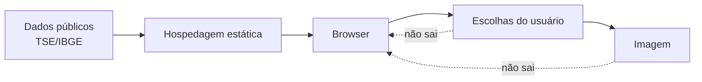

# 06 — Privacidade e segurança

## 1. Objetivo

A sensibilidade do projeto não está em possuir dados pessoais tradicionais, mas em potencialmente revelar **intenção de voto**. Portanto, o objetivo principal de segurança e privacidade é impedir que a infraestrutura precise receber essa informação.

A melhor garantia é estrutural: se o sistema não coleta o dado, há muito menos para proteger, vazar, vender, requisitar ou correlacionar.

## 2. Inventário de dados

| Dado | Necessário? | Persistido pelo projeto? | Transmitido como dado da aplicação? | Observação |
|---|---:|---:|---:|---|
| Ano atual | Sim | Não | Não | Obtido do dispositivo; configuração local define o pleito |
| Coordenadas | Opcional | Não | Não | Devem permanecer no navegador; resolução territorial é local |
| UF de votação | Sim quando aplicável | Não | Não | Se os dados forem particionados por UF, o caminho do arquivo requisitado pode tornar a UF inferível em logs técnicos |
| Município de votação | Apenas em eleição municipal | Não | Não | O mesmo cuidado vale para particionamento por município; preferir desenho que minimize essa inferência |
| Candidatos escolhidos | Sim | Não | Não | Estado efêmero em memória; requests de fotos não devem funcionar como telemetria implícita de seleção |
| Imagem da colinha | Sim | Não | Não | Gerada no navegador |
| Nome do eleitor | Não | Não | Não | Não solicitado |
| CPF/título de eleitor | Não | Não | Não | Não solicitado |
| E-mail/telefone | Não | Não | Não | Não solicitado |
| Analytics comportamental | Não | Não | Não | Não integrar trackers |

## 3. Fronteira de privacidade



A hospedagem pode observar requisições normais de arquivos por necessidade técnica do protocolo HTTP, mas não deve receber payload que revele a composição da colinha.

### 3.1 Circunscrição e logs de arquivos estáticos

Uma SPA estática não elimina os logs HTTP da infraestrutura. Se o navegador solicitar `/data/2026/MA/...`, o provedor de hospedagem pode tecnicamente registrar que aquele endereço IP pediu um arquivo do Maranhão. Isso **não equivale a registrar voto**, mas impede afirmar que a UF jamais pode ser inferida.

A implementação deve escolher conscientemente entre desempenho e minimização desse sinal:

- arquivos por UF reduzem tráfego, mas tornam a UF inferível pelo path;
- pacotes nacionais maiores reduzem essa inferência, mas aumentam download;
- em eleição municipal, particionar por UF e resolver município no cliente tende a ser compromisso melhor do que criar requests específicos por município;
- nenhuma dessas requisições deve conter um identificador de usuário criado pela aplicação.

Essa decisão de particionamento deve ser medida quando houver dados reais de tamanho do snapshot, e registrada em ADR se alterar a garantia pública de privacidade.

Por essa razão, a organização dos arquivos também deve evitar URLs específicas que revelem a escolha individual. Carregar um arquivo público de lista de candidatos por cargo é aceitável; requisitar um endpoint `candidate/<id>` somente após cada escolha poderia gerar um log inferível. Preferir carregar índices/listas e imagens de maneira que logs não constituam registro confiável da escolha.

### Consequência importante sobre fotos

Se cada fotografia for requisitada apenas quando o usuário seleciona um candidato, logs de CDN/hospedagem podem revelar forte sinal da escolha. Portanto, a implementação deve tratar isso explicitamente.

Opções, em ordem de preferência arquitetural:

1. carregar fotos mostradas nos resultados de busca, de modo que request de foto represente visualização de resultado e não confirmação de escolha;
2. usar bundling/sprites/pacotes por cargo quando viável;
3. configurar hospedagem sem analytics e com retenção mínima disponível;
4. nunca criar endpoint de telemetria de seleção.

A promessa correta deve ser “o projeto não envia nem armazena suas escolhas”, e não uma alegação impossível de que nenhum provedor de infraestrutura produz qualquer log técnico.

## 4. Geolocalização

### Risco

A Geolocation API retorna coordenadas precisas. Enviá-las a Google Maps, Mapbox, Nominatim público ou outro serviço de reverse geocoding criaria uma nova parte capaz de observar a localização.

### Controle

Resolver localmente:

```text
coordenadas
   ↓
malha das UFs no browser
   ↓
UF
   ↓ se necessário
malha municipal da UF
   ↓
município
```

As malhas podem ser derivadas da Malha Municipal Digital do IBGE e simplificadas no pipeline para uso web.

Na implementação de 2026, a malha mínima das UFs fica em arquivo estático local e só é requisitada depois do clique em “Usar minha localização”. A aplicação mantém latitude e longitude apenas dentro da operação assíncrona que resolve a UF; seu resultado público contém somente a sigla estadual. A sugestão precisa de confirmação e qualquer erro retorna ao formulário manual sem fallback remoto.

### UX de segurança

- geolocalização é opt-in;
- explicar por que é pedida;
- confirmação obrigatória da circunscrição sugerida;
- opção manual sempre visível;
- não pedir localização em ano sem eleição suportada.

## 5. Ameaças e controles

### 5.1 Dados eleitorais adulterados

**Risco:** alguém altera número, nome, foto ou situação.

**Controles:**

- fonte oficial identificada;
- pipeline determinístico;
- pipeline e mapeamentos revisáveis no Git;
- validação de schema e invariantes;
- hashes/versões de snapshot;
- branch protection;
- revisão de alterações no pipeline;
- metadados de proveniência.

### 5.2 Supply chain

**Risco:** dependência comprometida executa código de tracking ou altera imagem.

**Controles:**

- poucas dependências;
- lockfile versionado;
- versões fixadas;
- revisão por PR das mudanças de código e infraestrutura;
- auditoria automatizada;
- evitar scripts runtime por CDN;
- CSP restritiva.

### 5.3 XSS

**Risco:** campo textual externo contém conteúdo malicioso.

**Controles:**

- tratar todos os dados externos como texto;
- não usar `innerHTML` com campos do TSE;
- validação e limites de tamanho;
- CSP sem `unsafe-inline` quando tecnicamente viável;
- nenhuma entrada do usuário publicada para outros usuários.

### 5.4 Snapshot parcial

**Risco:** parte dos cargos atualiza e outra parte não.

**Controle:** publicação atômica por versão de snapshot. Um build só entra em produção se o conjunto completo necessário passar nas validações.

### 5.5 Fonte oficial indisponível

**Risco:** pipeline falha.

**Controle:** manter último snapshot validado. O site não precisa consultar o TSE no acesso do visitante.

### 5.6 Comprometimento do repositório

**Controles:**

- 2FA dos mantenedores;
- permissões mínimas no token do CI;
- proteção de branch;
- revisão obrigatória quando houver mais de um mantenedor;
- Actions com permissões mínimas;
- pin de actions por commit quando adequado.

## 6. Headers e política do navegador

Recomendações:

- HTTPS obrigatório;
- Content-Security-Policy restritiva;
- `Referrer-Policy: no-referrer` ou política equivalente mínima;
- `X-Content-Type-Options: nosniff`;
- `Permissions-Policy` restringindo APIs não utilizadas;
- geolocation liberada apenas para a própria origem quando necessária;
- evitar framing por terceiros (`frame-ancestors 'none'` ou equivalente);
- nenhuma conexão externa não documentada em `connect-src`.

A capacidade exata de configurar headers dependerá da hospedagem escolhida. Se GitHub Pages não permitir todas as garantias desejadas diretamente, essa limitação deve ser documentada e considerada na escolha final de hosting.

## 7. Persistência local

Por padrão, não usar:

- localStorage;
- sessionStorage para escolhas;
- IndexedDB;
- cookies funcionais para a colinha.

Variáveis em memória são suficientes.

Se futuramente for solicitado “salvar rascunho”, a funcionalidade exige nova análise de privacidade e ADR. Mesmo armazenamento somente local deve ser opt-in e claramente explicado.

## 8. Logs

Não criar logs de aplicação contendo:

- candidato pesquisado;
- candidato selecionado;
- número digitado;
- UF/município escolhido;
- coordenadas;
- conteúdo da imagem.

Logs técnicos inevitáveis da hospedagem devem ser minimizados dentro das capacidades do provedor. A documentação pública deve distinguir claramente “não coletamos escolhas” de “nenhuma infraestrutura na internet gera logs de acesso”.

## 9. Neutralidade como requisito de segurança institucional

Além de segurança técnica, o projeto deve reduzir risco de manipulação editorial:

- ordenação determinística;
- ausência de personalização;
- ausência de patrocínio de candidatos dentro da seleção;
- mudanças de regra revisáveis em Git;
- nenhuma fonte não oficial utilizada silenciosamente para corrigir/alterar candidato.

## 10. Proveniência dos dados

O snapshot deve permitir reconstruir:

```text
candidato exibido
     ↓
registro normalizado
     ↓
arquivo oficial de origem
     ↓
data de geração/importação
     ↓
versão do pipeline
```

Para 2026, a fonte principal é o conjunto “Candidatos — 2026” do Portal de Dados Abertos do TSE, que inclui CSVs e fotografias por UF e para Presidente (`BR`).

## 11. Política de divulgação de vulnerabilidades

Antes do lançamento público, o repositório deve incluir `SECURITY.md` com canal de relato responsável, escopo e expectativa de não divulgar dados eleitorais reais em demonstrações de vulnerabilidade.
